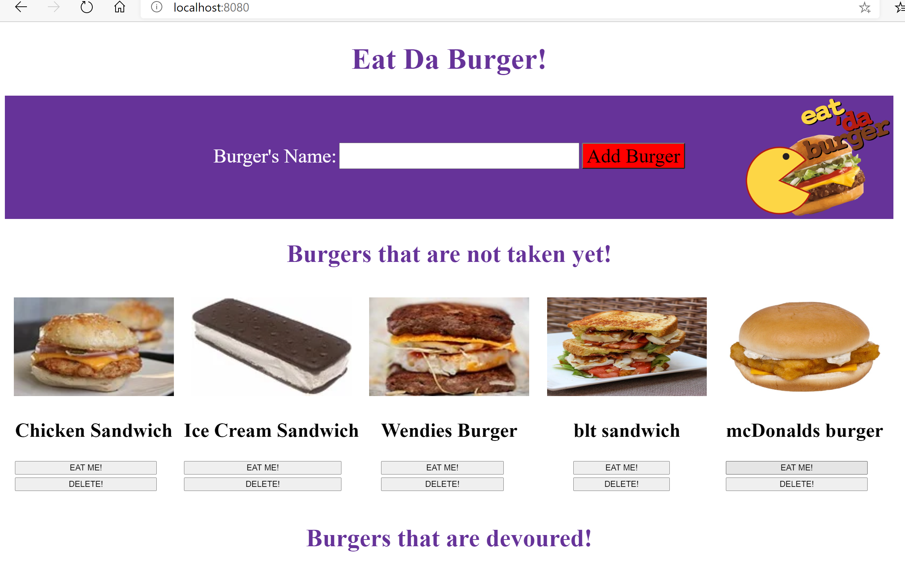
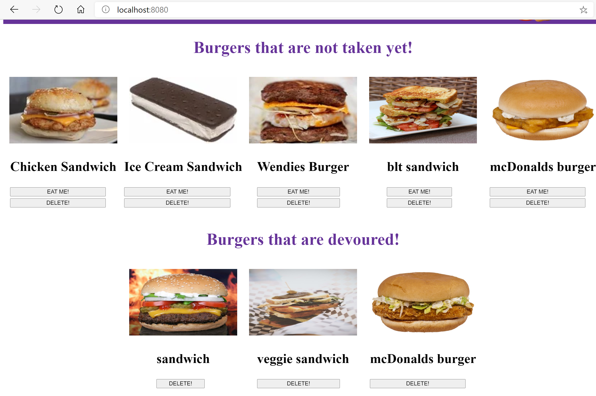

# Eat Da Burger 
## Description 
* Eat Da Burger! is a restaurant app that lets users input the names of burgers they'd like to eat.

* Whenever a user submits a burger's name, app will display the burger on the top part of the page -- waiting to be devoured.

* Each burger in the waiting area also has a `Eat Me!` button. When the user clicks it, the burger will move to the lower portion of the page.

* App will store every burger in a database, whether devoured or not. 

* Burger also has delete button to erase it from the database.

* Image of the burger provided by running pexel API if there is no image it display default image.

## Table of Contents
* [Installation](#installation)
* [Usage](#usage)
* [License](#license)
* [Questions](#questions)
* [Review](#review)
## Installation 
You can clone or fork the repo. Or just visit the deployed site:  https://boiling-badlands-26235.herokuapp.com/.
## Usage 
Visit the deployed site. https://boiling-badlands-26235.herokuapp.com/

Desktop version Form and Ready section
 
Desktop version Ready and Devoured section
 

 

## Contributing 
 None 
## License 
 Licensed under MIT License. 
## Tests 
 None
## Questions 
 You can see more of my Projects on my [GitHub profile](https://github.com/sbolotnikov) 

 Contact [sbolotnikov](mailto:sbolotnikov@gmail.com) 
## Review 
  * Here is this repo link: https://github.com/sbolotnikov/Eat-Da-Burger
 
  * Link: [Eat Da Burger]( https://boiling-badlands-26235.herokuapp.com/)